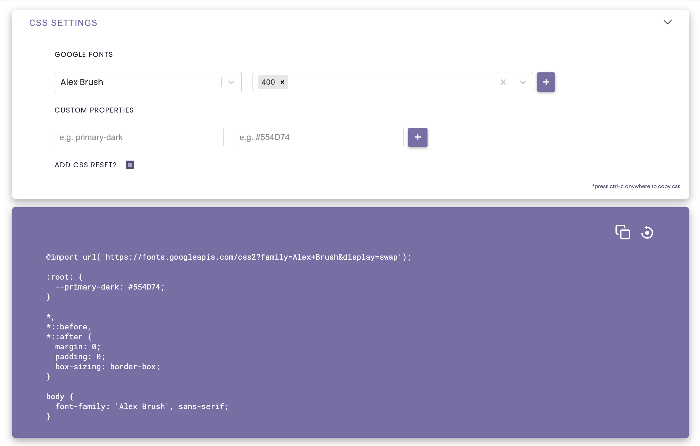
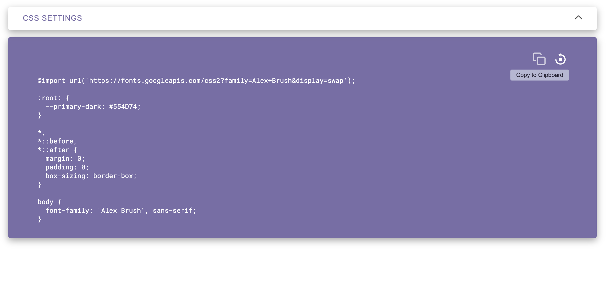
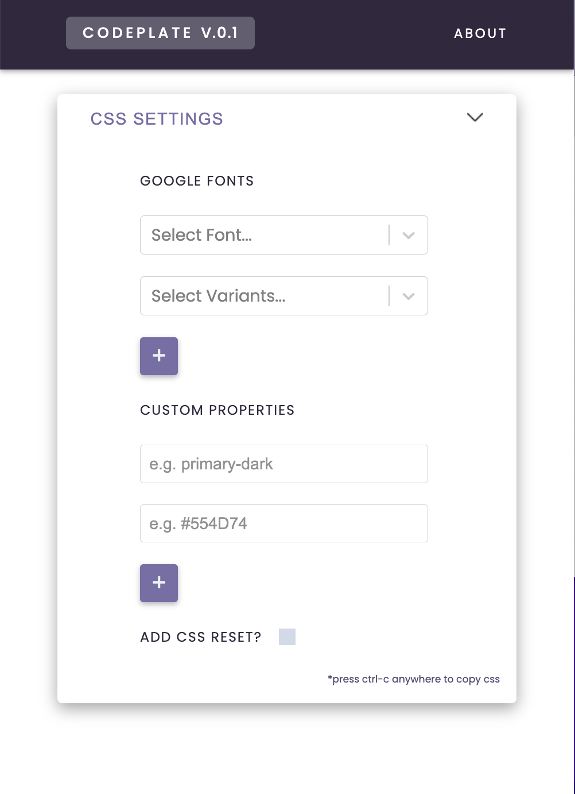

# CodePlate

Web application to quickly generate boilerplate code

## Overview

CodePlate is a web-based application that allows users to quickly and easily generate boilerplate code for their projects. In this first version, I've added the logic to render some very standard CSS starter code with font, custom property, and css reset customizations.

### Screenshots

### Built with

React
Google Fonts API

### Continued development

I think there is a lot of opportunity to expand this tool to include boilerplates for other coding project types. Web scraping, machine learning, data analysis, and others.
